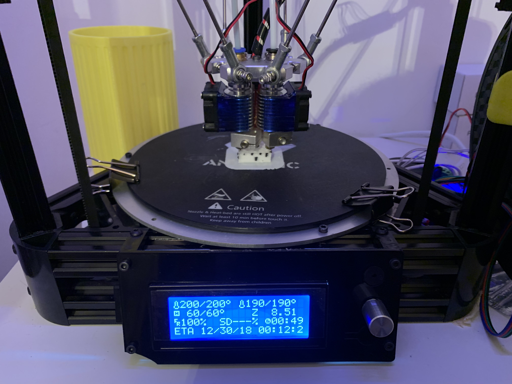

marlin-micromake-modified
=========================

This repository contains the marlin firmware for Marcus's
modified version of Micromake D1 Delta printer.

The original readme for Marlin 1.1.x is
[here](README_Marlin.md).

## Hardware Modifications

- All axis and extruder stepper drivers have been upgraded
  to TMC2130 ([FYSETC's v1.0/2130 Silent StepStick](https://www.aliexpress.com/item/5pcs-TMC2130-V1-0-2130-New-TMC-V1-1-Three-Kinds-Stepstick-Stepper-Motor-Driver-SPI/32850653898.html?spm=a2g0s.9042311.0.0.35d04c4dh8ReAI),
  configured in SPI mode).
- Upgrade motherboard from the old MicroMake board to
  [MakeBoard Pro](https://www.aliexpress.com/item/Micromake-MakeBoard-Pro-3D-Printer-Main-Board-Support-Heatbed-Compatible-Ramps-1-4/32763830145.html?spm=a2g0s.9042311.0.0.35d04c4dh8ReAI).
- Add a secondary extruder and hot end with a generic
  delta dual v6 aluminum effector => Dual Extrusion.
- Remove Z probe, which means `PROBE_MANUALLY`.
- Replace the original carbon fiber push rods with
  200mm steel ones.

## Pictures

